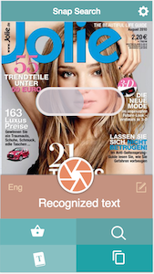
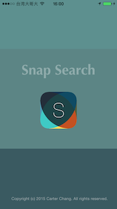
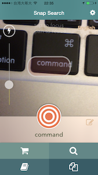
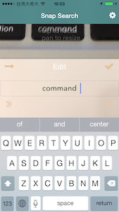
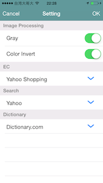

##  ios-snapSearch
--------------------------------------------------

This is an iOS app powered by TesseractOCR for text recognition and OpenCV for image processing.

### Mock

### Work through

### Screen

### Credits
---------
* [Tesseract-OCR-iOS](https://github.com/gali8/Tesseract-OCR-iOS)
* [openCV](http://opencv.org)
* [Font awesome](http://fortawesome.github.io/Font-Awesome/)
* [BFPaperButton](https://github.com/bfeher/BFPaperButton)
* [FXBlurView](https://github.com/nicklockwood/FXBlurView)
* [DKCircleButton](https://github.com/kronik/DKCircleButton)
* [Toast](https://github.com/scalessec/Toast)
